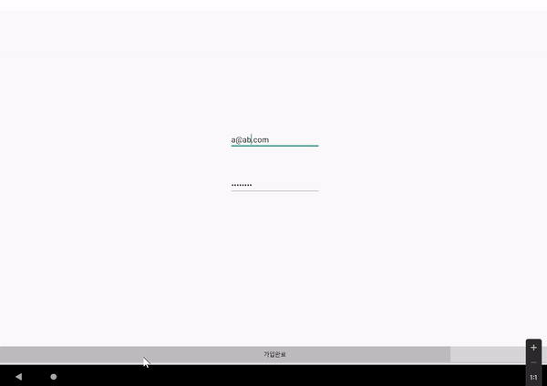

# TRAY
## 세부사항
- 주제 : 가이드 트레이싱 기법을 이용한 디자인 앱 (TRAY)

- 공동 참여자 : 김경진 이은총 김진호

- 실행 환경 : 안드로이드 스튜디오

- 실행 방법 : 안드로이드 앱

- 개발 환경 : Windows 10, 최신버전 Android Studio Giraffe 빌드확인완료

# 개요

[시스템 구성도](#시스템구성도)

[동작 방법](#동작-방법)

[작동 화면](#작동-화면)

[추가 라이선스](#추가-라이선스)

# 시스템구성도

- 시스템 구성

- 콘텐츠 흐름도

# 동작 방법
## 설치 방법

1. 하단 폴더의 파일을 다운로드 한다

2. 다음의 파일을 압축 해제하여, 해제된 폴더의 경로를 통해 안드로이드 스튜디오를 실행한다

## 환경 설정

gradle 플러그인 버전 : 8.1.3

SDK Platforms :  Android 13.0 ("Tiramisu") API 33

SDK Tools : Android SDK Bulid_Tools 34,

Android Emulator 32.1.12,

Android Emulator hypervisor driver (installer) 2.0.0,

Android SDK Platform-Tools 34.0.1

## 안드로이드 스튜디오를 이용한 실행 화면

# 작동 화면

1. 실행시 기본적인 동작화면

- 앱 실행

* 테그 검색 및 그림 생성
  * 관련된 이미지가 없을 땐 즉시 그림 제작(->그림판 프로세스)

2. 기본적인 그림판 프로세스

3. firebase를 이용한 창작마당 로그인

- 회원 가입

- 회원 가입 오류 메세지

- 회원 가입 완료 및 로그인

# 추가 라이선스
## Google firebase
Version 2.0, January 2004

Licensed under the Apache License, Version 2.0 (the "License"); you may not use this file except in compliance with the License. You may obtain a copy of the License at

http://www.apache.org/licenses/LICENSE-2.0

Unless required by applicable law or agreed to in writing, software distributed under the License is distributed on an "AS IS" BASIS, WITHOUT WARRANTIES OR CONDITIONS OF ANY KIND, either express or implied.

[More](https://github.com/firebase/quickstart-android/blob/master/LICENSE)
